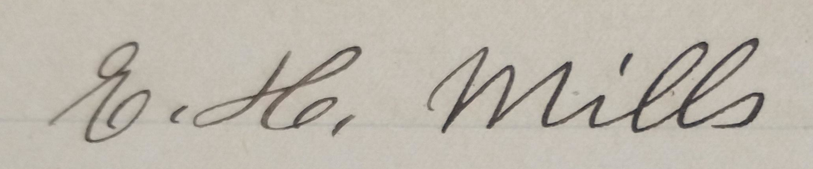

This publication attempts to document all extant information on the family of Edward H. Mills (1819-1908), with particular emphasis on Emily Mills (1858-1937) and the family's time in Brooktondale.

<!--more-->

<figure width="500px" class="hero">
    
    <figcaption style="max-width: 500px">From the records of E. H. Mills general store in Brookton, written by Emily Mill's hand, in the months immediatiately following her father Edward's death.</figcaptio>
</figure>

## Family Portraits

{}

{}
{}

## Burials

[Edward](https://www.findagrave.com/memorial/75958691/edward-h-mills), [Mary Ann](https://www.findagrave.com/memorial/75958702/mary-ann-mills), [Jonas](https://www.findagrave.com/memorial/75958930/jonas-e-mills ) and [Horace](https://www.findagrave.com/memorial/75958913/horace-f-mills) are interred at Evergreen Hill Cemetery, 112 Alleghany Rd, Corfu, NY 14036.

[Hannah](https://www.findagrave.com/memorial/168944385/hannah-mills) is interred at Pleasant Grove Cemetery, 184 Pleasant Grove Rd, Ithaca, NY 14850.

[Emily](https://www.findagrave.com/memorial/160363879/mary-emily-mills) is interred at Brookton (formerly Quick) Cemetery at the corner of Landon Road and Lounsbery Road in Brooktondale NY, 14817.

[Ellen Gould](https://www.findagrave.com/memorial/35944445/ellen-jane-predmore) is interred at Seneca Union Cemetery, 6292 NY-414, Hector NY, 14841.

## Census Data

The following represents a summary of all of the data that I have been able to access. 

{}

According to [newyorkfamilyhistory.org](https://www.newyorkfamilyhistory.org/):
<blockquote class="quote-only">
The second Constitution of the State of New York, written in 1821, required that a state census be taken in 1825 and every ten years after that - censuses were then taken every ten years until 1875. 

Due to a number of political and bureaucratic conflicts, no state census was taken in 1885 - New York State wound up taking a census in 1892, skipped the census which should have occurred in 1895, and then resumed census-taking every ten years in the fifth year of each decade - 1905, 1915, and 1925. The state census was officially abolished in 1931, so the 1925 state census is the last one that exists. 

...In 1911, a fire in New York's State Capitol, Albany, destroyed an enormous amount of crucial historical and genealogical records. 
</blockquote>

The source documents are:

{}
{}
{}
{}
{}
{}
{}
{}
{}
{}
{}
{}

