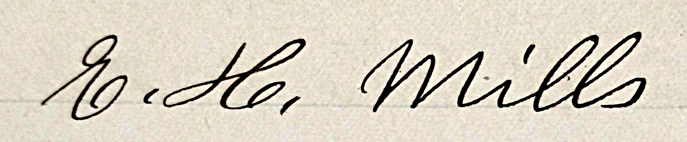

This publication attempts to document all extant information on the family of Edward H. Mills (1819 to 1908), with particular emphasis on Emily Mills (1858 to 1937) and the family's time in Brooktondale (formerly known as Brookton, and before that, Mott's Corners).

<!--more-->

<figure class="image" width="500px">
    
    <figcaption style="max-width: 500px">From the records of E. H. Mills general store in Brookton, written by Emily Mills' hand, in the months immediatiately following her father Edward's death.</figcaptio>
</figure>

## Family Photographs

{}

{}
{}

## Burials

[Edward](https://www.findagrave.com/memorial/75958691/edward-h-mills), [Mary Ann](https://www.findagrave.com/memorial/75958702/mary-ann-mills), [Jonas](https://www.findagrave.com/memorial/75958930/jonas-e-mills ) and [Horace](https://www.findagrave.com/memorial/75958913/horace-f-mills) are interred at Evergreen Hill Cemetery, 112 Alleghany Rd, Corfu NY 14036.

[Hannah](https://www.findagrave.com/memorial/168944385/hannah-mills) is interred at Pleasant Grove Cemetery, 184 Pleasant Grove Rd, Ithaca NY 14850.

[Emily](https://www.findagrave.com/memorial/160363879/mary-emily-mills) is interred at Brookton (formerly Quick) Cemetery at the corner of Landon Road and Lounsbery Road in Brooktondale NY, 14817.

[Ellen Gould](https://www.findagrave.com/memorial/35944445/ellen-jane-predmore) is interred at Seneca Union Cemetery, 6292 NY-414, Hector NY, 14841.

## Census Data

The following represents a summary of all of the census data that I have been able to access. 

{}

According to [newyorkfamilyhistory.org](https://www.newyorkfamilyhistory.org/):
    
<blockquote class="quote-only">

The second Constitution of the State of New York, written in 1821, required that a state census be taken in 1825 and every ten years after that - censuses were then taken every ten years until 1875. 

Due to a number of political and bureaucratic conflicts, no state census was taken in 1885 - New York State wound up taking a census in 1892, skipped the census which should have occurred in 1895, and then resumed census-taking every ten years in the fifth year of each decade - 1905, 1915, and 1925. The state census was officially abolished in 1931, so the 1925 state census is the last one that exists. 

...In 1911, a fire in New York's State Capitol, Albany, destroyed an enormous amount of crucial historical and genealogical records. 

</blockquote>

The source documents are:

{}
{}
{}

{}
{}
{}

{}
{}
{}

{}
{}
{}

Hannah's entries as an Eastman:

{}
{}
{}

